# ChurnGuard: Predictive Churn & Agentic Retention Orchestrator

An XGBoost churn-risk classifier hands off SHAP-explained high-risk accounts to a **Groq-powered LangGraph** agent that drafts personalized retention offers — gated behind human approval in Slack, with every state transition logged to Supabase for full audit traceability.

[](https://www.python.org/)
[](https://xgboost.readthedocs.io/)
[](https://fastapi.tiangolo.com/)
[](https://n8n.io/)
[](https://groq.com/)
[](https://supabase.com/)

---

## System Architecture Topology

```
┌─────────────┐     ┌────────────┐     ┌───────────┐     ┌───────────────────┐
│    Data     │ --> │  XGBoost   │ --> │   SHAP    │ --> │     LangGraph      │
│ DuckDB /    │     │ Classifier │     │TreeExplain│     │  (Groq Llama-3.3)  │
│  Parquet    │     │ AUC: 0.91  │     │ Top-3 Drv │     │   4-Node FSM       │
└─────────────┘     └────────────┘     └───────────┘     └──────────┬─────────┘
                                                                     │
                                                                     v
┌─────────────┐     ┌────────────┐     ┌───────────┐     ┌───────────────────┐
│  Supabase   │ <-- │   Slack    │ <-- │    n8n    │ <-- │      FastAPI       │
│ Audit Log   │     │   HITL     │     │ Webhooks  │     │ /invoke  /resume   │
└─────────────┘     └────────────┘     └───────────┘     └───────────────────┘
```

Every arrow above is a validated handshake — Pydantic schemas at the ML → agent boundary, checkpointed thread state at the pause/resume boundary — not just a diagram convenience.

---

## Technical Deep Dive

<details>
<summary><strong>📊 Predictive ML Layer (XGBoost)</strong></summary>

<br>

A `binary:logistic` XGBoost classifier trained on a stratified 70/15/15 split, with `scale_pos_weight` handling class imbalance and Optuna driving a 20-trial hyperparameter search (`max_depth`, `eta`, `subsample`, `colsample_bytree`) logged to MLflow.

**Test-set results:**

| Threshold | Precision | Recall | F1 |
|---|---|---|---|
| Default (0.50) | 29.6% | 81.1% | 0.434 |
| Business-tuned (0.41) | 27.7% | **87.4%** | 0.421 |

**ROC-AUC: 0.91**

The business-tuned threshold isn't chosen to maximize overall F1 — it's chosen to maximize recall specifically on top-decile-ARR accounts, per the evaluation script's logic. At that threshold, the model catches **97 of 111** actual churners (**only 14 false negatives**), trading precision for the far more expensive failure mode: silently losing a high-ARR customer.

**Live pipeline run** — `evaluate_model.py` executing end-to-end and writing `metrics.json` + the plot below:

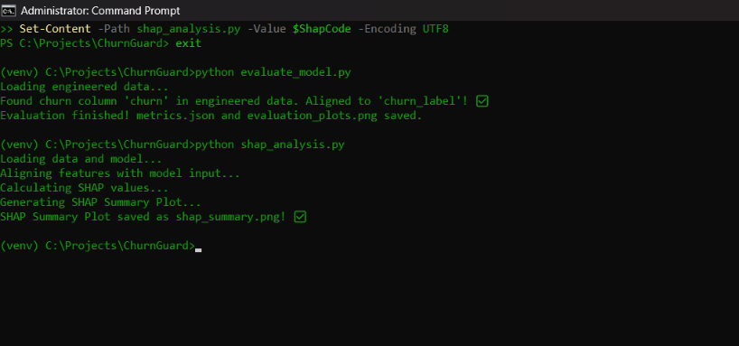

**Resulting output:**

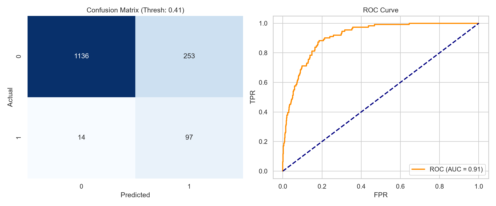

</details>

<details>
<summary><strong>🔍 Explainable AI (SHAP)</strong></summary>

<br>

A `TreeExplainer` computes both global and per-account local SHAP values. Globally, `csat` and `ticket_count` dominate, followed by `seat_utilization_pct` and `arr` — support friction and low product engagement outweigh commercial terms as churn drivers.

For each flagged account, `batch_scoring.py` sorts local SHAP values by absolute magnitude, keeps only the **positive** (churn-pushing) contributors, and extracts the top 3 by name. This isn't eyeballed off a plot — it's the exact `top_3_shap_drivers` list that gets schema-validated and passed into the agent payload, meaning the retention offer the LLM drafts is grounded in the same explainability layer a data scientist would use, not a black box.

**Live pipeline run** — `shap_analysis.py` executing end-to-end and writing the summary plot below:


**Resulting output:**

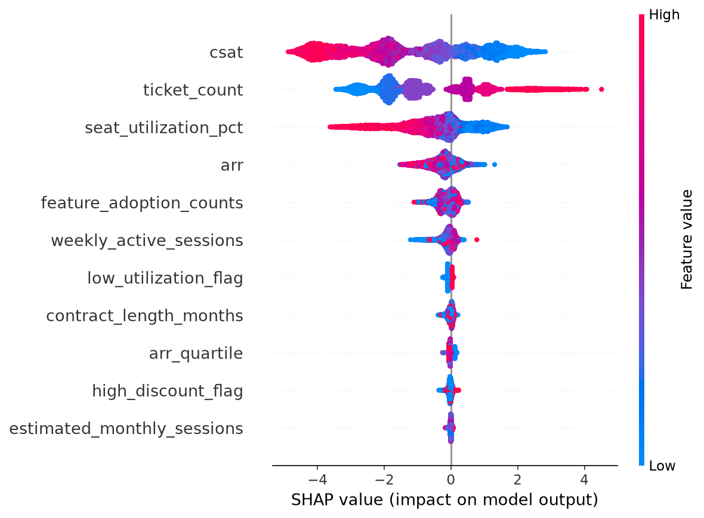

</details>

<details>
<summary><strong>🔌 API Boundary (FastAPI)</strong></summary>

<br>

The classical ML layer and the agentic layer meet at a FastAPI microservice with two strict-mode Pydantic v2 endpoints, both self-documented via the auto-generated OpenAPI 3.1 schema.

**`POST /api/v1/invoke`** — accepts `{account_id, arr, top_3_shap_drivers, churn_probability}`, runs the LangGraph state machine up to the `HITLApprovalGate` interrupt, and returns the drafted offer + thread ID:

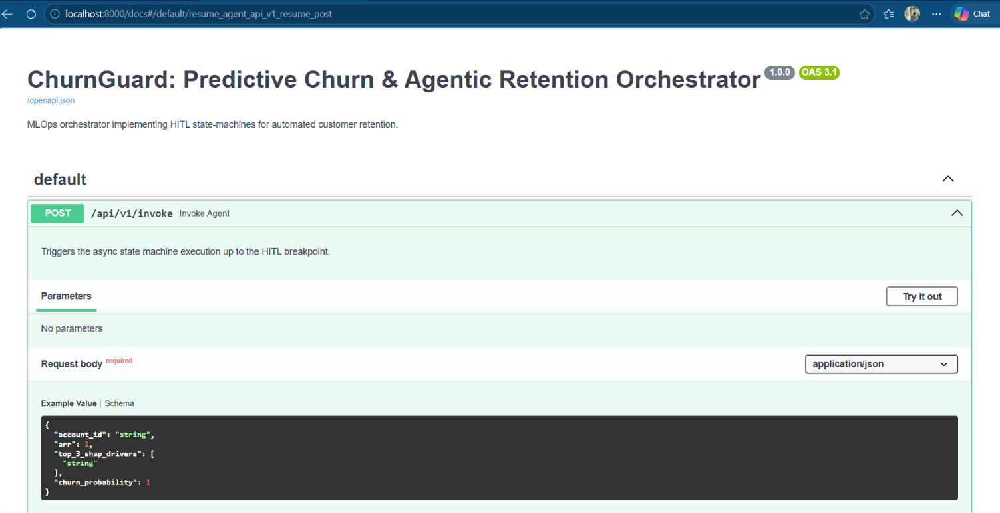
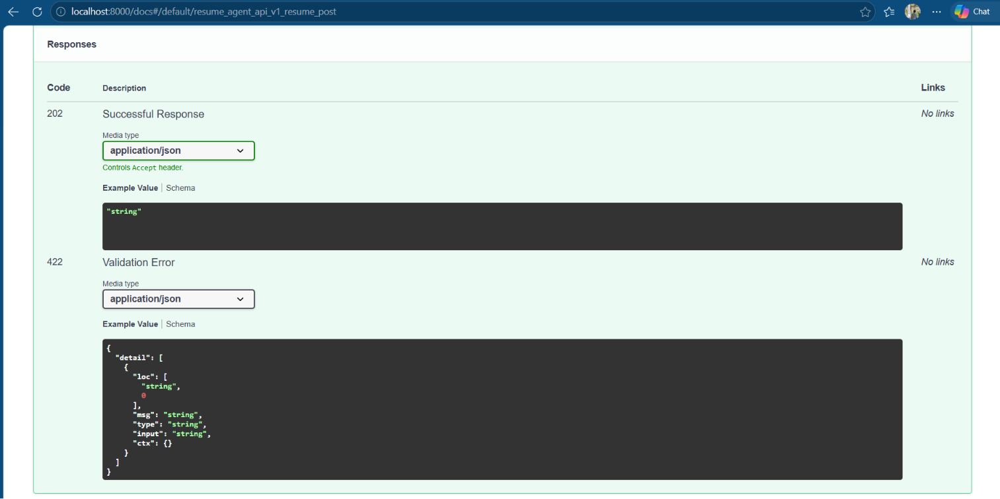

**`POST /api/v1/resume`** — accepts `{thread_id, approved, human_feedback}`, injects the human decision into the checkpointed state via `MemorySaver`, and resumes the graph to completion:

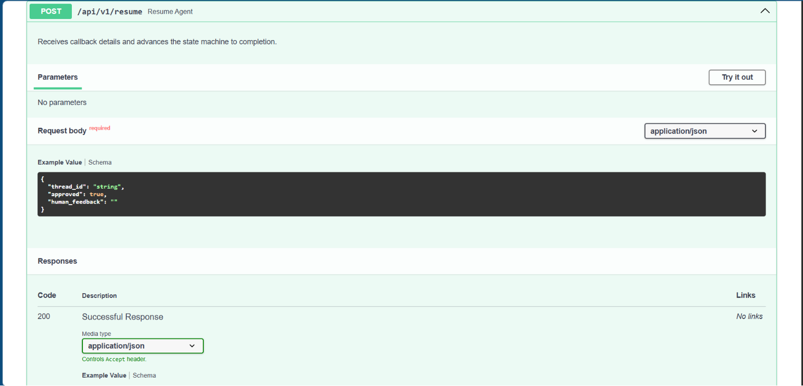
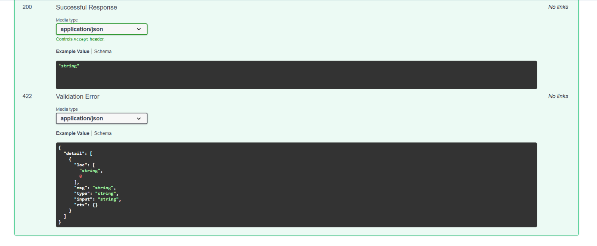

`extra="forbid"` on both schemas means a malformed or unexpected field is rejected with a `422` before it ever reaches the graph — visible below as one of four registered OpenAPI schema objects:

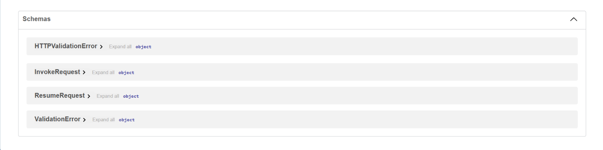

</details>

<details>
<summary><strong>🤖 Multi-Agent Orchestration (n8n & Groq)</strong></summary>

<br>

The agent itself is a 4-node LangGraph finite state machine:

```
AnalyzeRiskContext → DraftRetentionOffer → PolicyGuardrailCheck → HITLApprovalGate (interrupt)
```

`DraftRetentionOffer` is the one LLM call in the graph — routed through **Groq's Llama-3.3-70B-Versatile** via `langchain-groq`, chosen for inference latency low enough that the human reviewer in Slack sees the drafted offer appear almost instantly after the webhook fires.

Two n8n workflows own the orchestration boundary:

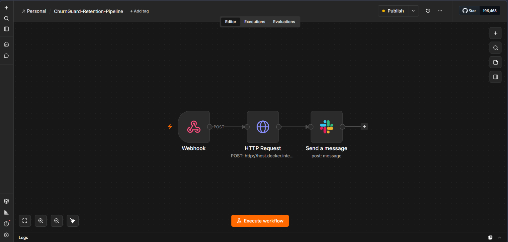
*`ChurnGuard-Retention-Pipeline.json` — webhook trigger → `HTTP Request` to `/api/v1/invoke` → Slack Block Kit notification.*

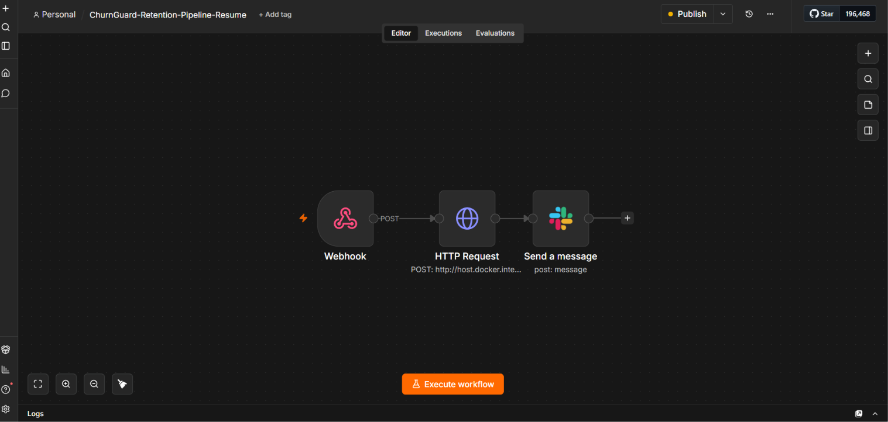
*`ChurnGuard-Retention-Pipeline-Resume.json` — a second, independent webhook → `HTTP Request` to `/api/v1/resume` → Slack confirmation. This is what lets the graph pause indefinitely without holding a server thread open.*

**Proof it's actually Groq, not OpenAI** — the live `uvicorn` server log shows the outbound call landing on `api.groq.com`, not `api.openai.com`, right alongside the Supabase audit writes for the same run:

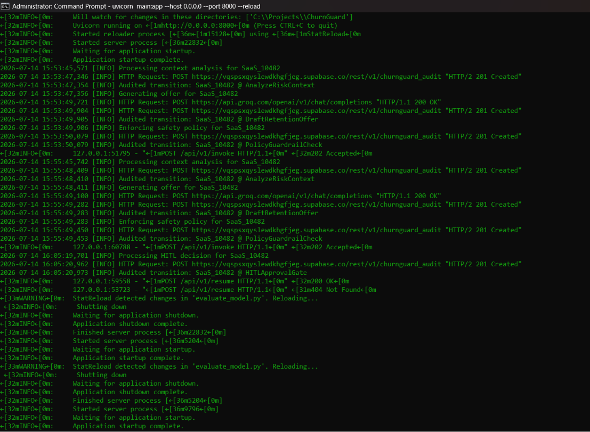

</details>

<details>
<summary><strong>✋ Human-in-the-Loop (Slack)</strong></summary>

<br>

When a high-risk account clears the policy guardrail, n8n's `Send a message` node posts to the `#churnguard` channel via the `n8n-Alerts` app integration, tagged with the run's `thread_id`. The CSM's decision is submitted back through the paired resume webhook — keyed to that same `thread_id` — which resumes the paused LangGraph thread exactly where it left off. Nothing about the drafted offer executes until a human signs off.

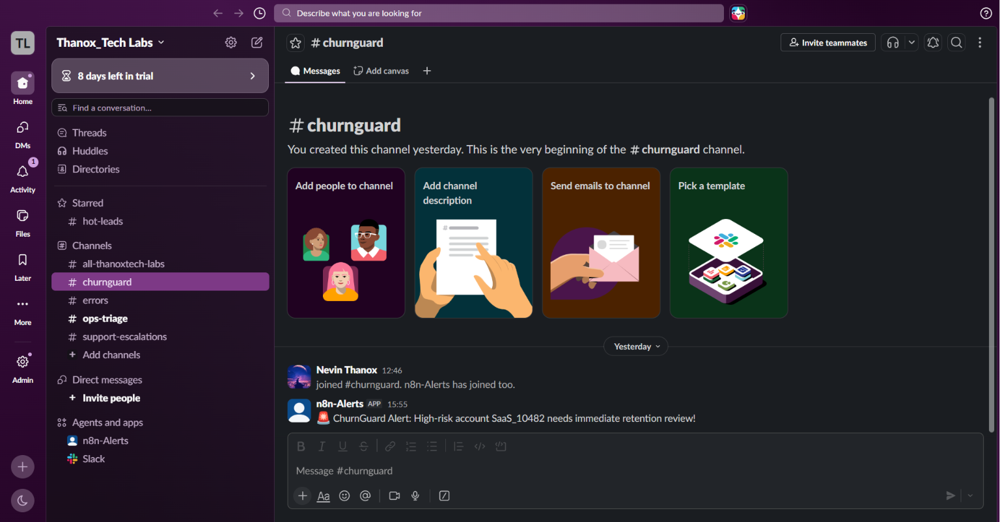

</details>

<details>
<summary><strong>🗂️ State Traceability (Supabase)</strong></summary>

<br>

Every node transition — `AnalyzeRiskContext`, `DraftRetentionOffer`, `PolicyGuardrailCheck`, `HITLApprovalGate` — writes a row to the `churnguard_audit` table: `account_id`, `transition_node`, and a JSON `state_snapshot` of what the graph knew at that moment. The table below shows exactly that sequence for account `SaaS_10482`, in order, with a real `created_at` timestamp — this is the deliverable that answers "why did the agent do X."

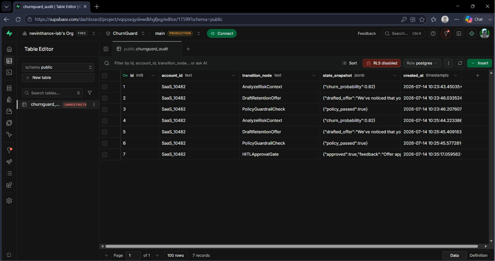

</details>

<details>
<summary><strong>🧪 CLI Integration Testing</strong></summary>

<br>

A full round trip validated directly over HTTP, no UI involved:

1. `curl` fires the n8n test webhook with a synthetic high-risk payload → `{"message":"Workflow was started"}`.
2. A direct `curl` to `/api/v1/invoke` with the same payload returns `202 Accepted`, a fresh `thread_id`, and a Groq-drafted two-sentence retention offer referencing the actual churn drivers and probability passed in.
3. `curl` to `/api/v1/resume` with `{"approved": true, "human_feedback": "..."}` returns `200 Completed` with `final_decision: "approved"`.
4. Replaying that same `resume` call a second time correctly returns `404 — Execution thread is inactive or expired`, confirming a completed thread can't be double-resumed.

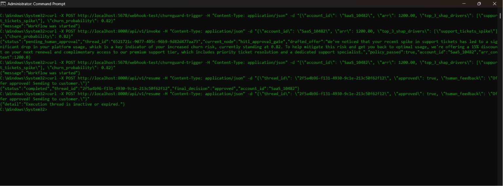

</details>

---

## Installation & Run Guide

**1. Clone and install dependencies**
```bash
git clone https://github.com/<your-username>/churnguard-retention-engine.git
cd churnguard-retention-engine
python -m venv venv && source venv/bin/activate   # Windows: venv\Scripts\activate
pip install -r requirements.txt
```

**2. Configure environment**

Create a `.env` file in the project root:
```env
GROQ_API_KEY=your_groq_api_key
GROQ_MODEL=llama-3.3-70b-versatile
SUPABASE_URL=your_supabase_project_url
SUPABASE_KEY=your_supabase_service_role_key
```

**3. Run the ML pipeline**
```bash
python data_pipeline.py      # synthetic data + DuckDB feature engineering
python train_xgboost.py      # Optuna + XGBoost, logged to MLflow
python evaluate_model.py     # metrics.json + evaluation_plots.png
python shap_analysis.py      # shap_summary.png
python batch_scoring.py      # high_risk_accounts_payload.json
```

**4. Launch the FastAPI agent service**
```bash
uvicorn api.main:app --reload --port 8000
```

**5. Wire up n8n**

Import both `ChurnGuard-Retention-Pipeline.json` and `ChurnGuard-Retention-Pipeline-Resume.json` into your n8n instance, attach your Slack credential, and activate both workflows. Point the main pipeline's `HTTP Request` node at `http://host.docker.internal:8000/api/v1/invoke` (or your deployed host).

**6. Fire a test event**

POST a `high_risk_accounts_payload.json` entry to the n8n webhook and watch it flow: XGBoost → SHAP → Groq-drafted offer → Slack → your approval → Supabase audit row.
