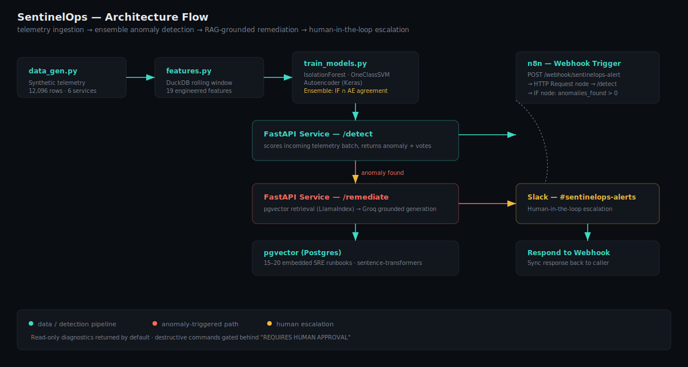
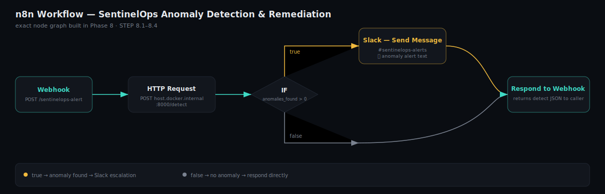
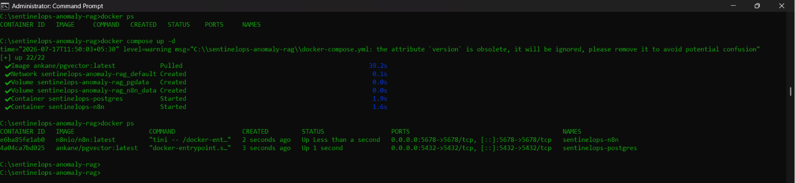
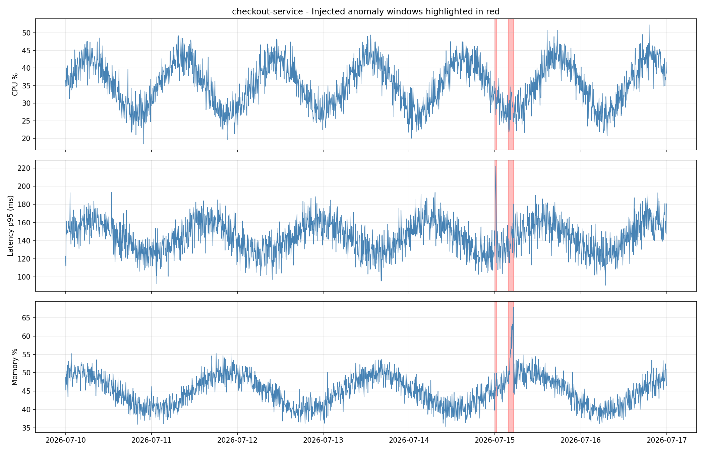
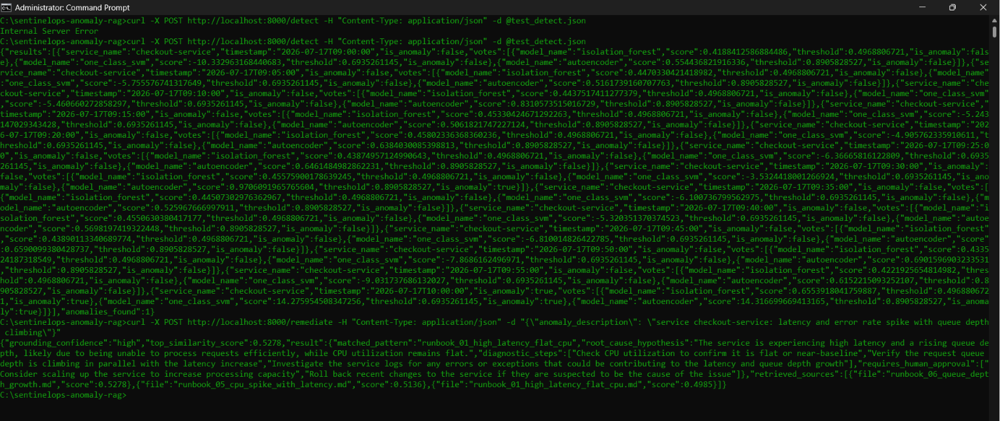
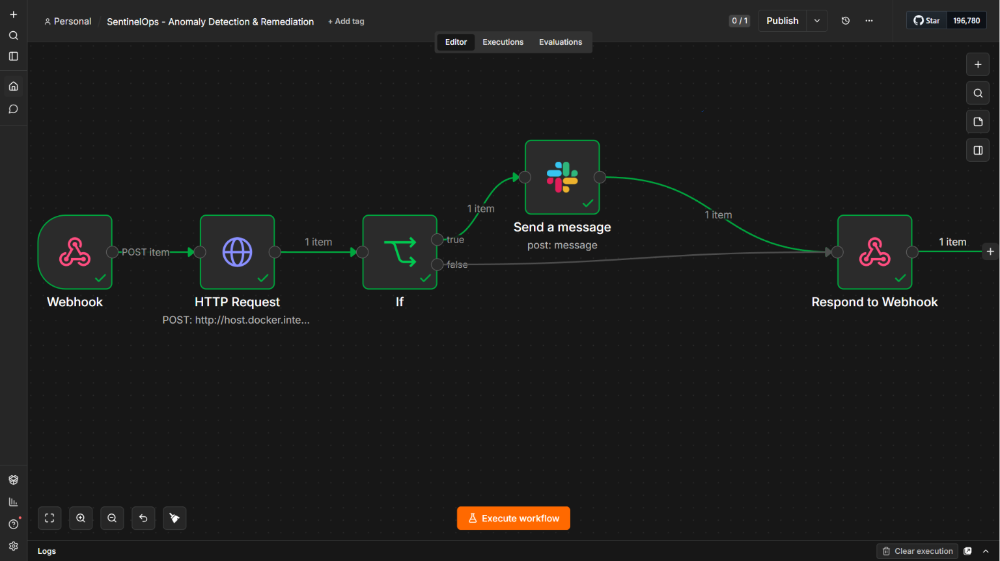
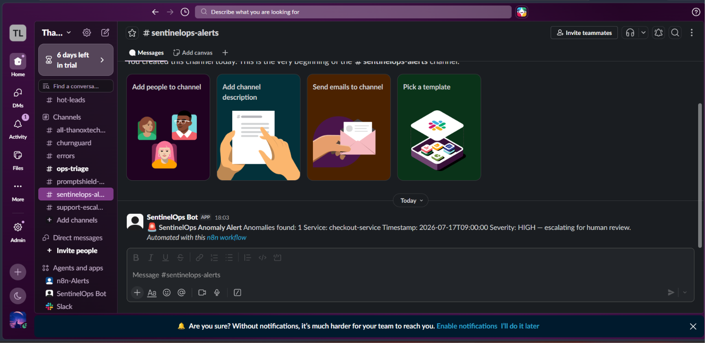
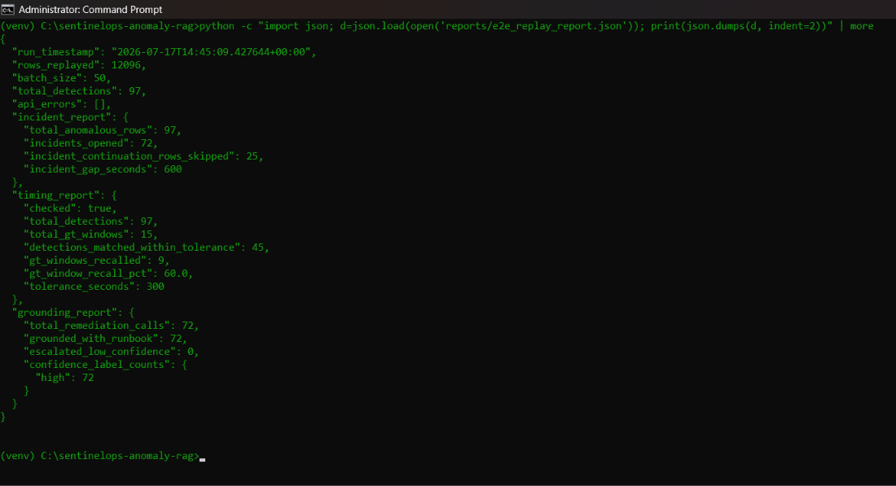
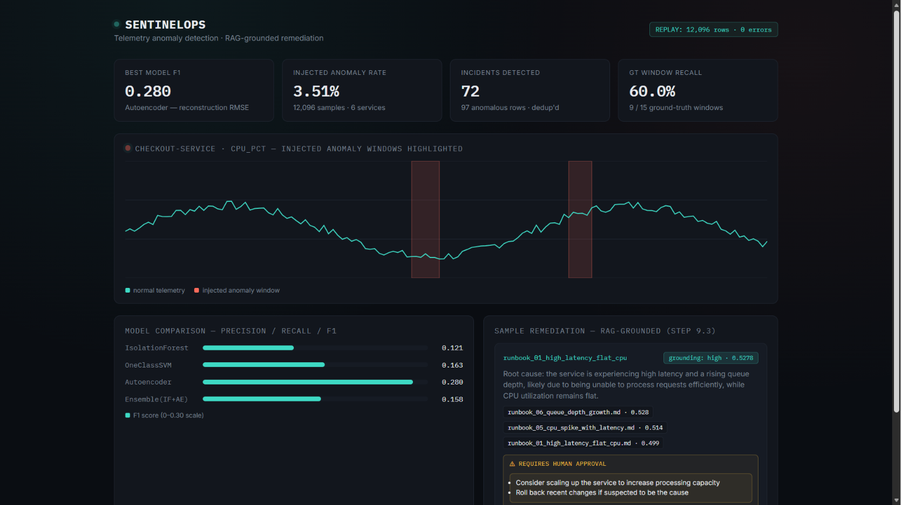
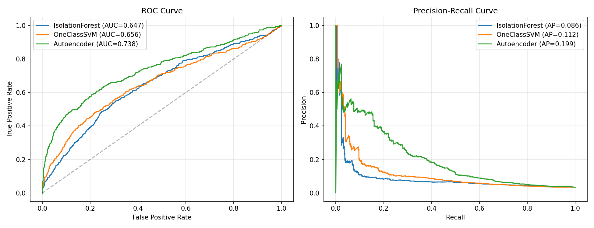

# SentinelOps — Telemetry Anomaly Detection with RAG-Grounded Remediation


**An ML anomaly-detection ensemble + pgvector RAG pipeline that turns raw infrastructure telemetry into guardrailed, human-approved SRE remediation runbooks.**

---

## Quick Summary

- 🔍 **3-model ensemble** (Isolation Forest + One-Class SVM + TensorFlow Autoencoder) scores 6 microservices' telemetry in real time.
- 📚 **RAG-grounded remediation** — every flagged anomaly is matched against a 20-runbook knowledge base via pgvector + LlamaIndex, not a hallucinated fix.
- 🛑 **Human-in-the-loop by design** — destructive commands are hard-gated behind a "REQUIRES HUMAN APPROVAL" block; low-confidence matches escalate instead of guessing.
- ⚡ **n8n orchestrates it all** — Webhook → FastAPI → IF-node severity routing → Slack escalation, fully automated.
- 📊 **Every metric on this page is real** — pulled straight from `metrics.json` and `reports/e2e_replay_report.json`, generated from an actual 12,096-row replay run. Zero placeholders.

---

## Repository Structure

```
sentinelops-anomaly-rag/
├── README.md
├── LICENSE
├── .env.example
├── .gitignore
├── docker-compose.yml
├── requirements.txt
├── metrics.json
├── diagrams/
│   ├── architecture_flow.svg
│   └── workflow_diagram.svg
├── screenshots/
│   ├── 01_docker_containers.png
│   ├── 02_eda_anomaly_plot.png
│   ├── 03_fastapi_smoke_test.png
│   ├── 04_n8n_execution.png
│   ├── 05_slack_alert.png
│   ├── 06_remediation_report.png
│   ├── 07_dashboard_overview.png
│   └── 08_roc_pr_curves.png
├── data/
│   └── raw/
│       ├── telemetry.parquet
│       └── ground_truth_windows.parquet
├── notebooks/
│   └── 01_eda.ipynb
├── knowledge_base/
│   └── runbooks/               (20 synthetic SRE runbooks)
├── reports/
│   ├── figures/
│   ├── dashboard.html
│   └── e2e_replay_report.json
├── src/
│   ├── data_gen.py
│   ├── features.py
│   ├── train_models.py
│   ├── evaluate.py
│   ├── rag_pipeline.py
│   ├── generate_runbooks.py
│   ├── index_runbooks.py
│   ├── schemas.py
│   └── app.py
├── n8n/
│   └── workflow_code.json
└── tests/
    └── test_e2e_replay.py
```

---

## Table of Contents

- [Overview](#overview)
- [The Problem It Solves](#the-problem-it-solves)
- [Architecture](#architecture)
- [Engineering Decisions](#engineering-decisions)
- [Tech Stack](#tech-stack)
- [Getting Started](#getting-started)
- [Proof It Works](#proof-it-works)
- [Scaling to Production](#scaling-to-production)

---

## Overview

SentinelOps is a synthetic-telemetry anomaly-detection pipeline built around a **3-model ensemble** that flags infrastructure anomalies (CPU, memory, latency p50/p95/p99, error rate, queue depth, thread count) across 6 simulated microservices. When an anomaly is flagged, a **pgvector + LlamaIndex RAG pipeline** retrieves the most relevant SRE runbook from a knowledge base of 20 synthetic runbooks and generates a grounded remediation response — with destructive commands explicitly gated behind human approval. An **n8n workflow** wires it all together: webhook trigger → FastAPI `/detect` + `/remediate` → conditional severity routing → Slack escalation.

The full pipeline was run end-to-end against **12,096 rows of telemetry across 6 services** with a **3.51% real anomaly rate**, and every number in this README comes directly from that run.

---

## The Problem It Solves

| Without SentinelOps | With SentinelOps |
|---|---|
| Engineers manually scan dashboards for anomalies | 3-model ensemble continuously scores every telemetry window |
| Remediation steps scattered across tribal knowledge / wiki pages | RAG pipeline retrieves the exact matching runbook automatically |
| On-call engineers guess whether a fix is safe to run | Destructive commands hard-gated behind human approval |
| No confidence signal on whether a suggested fix is even relevant | Grounding-confidence threshold escalates instead of guessing when no runbook matches |
| Alerting is manual / ad hoc | n8n automatically escalates high-severity or low-confidence cases to Slack |

---

## Architecture



**Flow:**
1. `src/data_gen.py` generates multi-metric synthetic telemetry with injected ground-truth anomaly windows (spike / slow-drift / flatline).
2. `src/features.py` computes rolling z-scores, rate-of-change, and cross-metric ratios via DuckDB SQL.
3. `src/train_models.py` trains Isolation Forest, One-Class SVM, and a TensorFlow Autoencoder on normal windows.
4. `src/evaluate.py` calibrates thresholds and combines model votes into an ensemble agreement rule.
5. FastAPI's `/detect` endpoint scores incoming telemetry batches in real time.
6. On a flagged anomaly, `/remediate` embeds the anomaly description, retrieves the closest-matching runbook from pgvector via LlamaIndex, and generates a grounded remediation response.
7. n8n's webhook triggers this flow, applies an IF-node routing rule, and posts high-severity/low-confidence cases to Slack.



---

## Engineering Decisions

- **Ensemble over single model** — Isolation Forest, One-Class SVM, and Autoencoder each catch different anomaly shapes (point spikes vs. slow drift vs. flatline); combining votes reduces blind spots any one model has alone.
- **Autoencoder reconstruction RMSE as the strongest single signal** — best F1 (0.2803) and ROC-AUC (0.7377) of the three individual models, consistent with autoencoders suiting multivariate drift.
- **Grounding-confidence gating, not blind generation** — the RAG layer explicitly reports a confidence label (`high`/`low`/`none`) instead of always returning an answer, so low-confidence cases escalate to a human rather than hallucinating a fix.
- **Read-only-by-default system prompt** — remediation output treats all commands as read-only unless explicitly wrapped in a "REQUIRES HUMAN APPROVAL" block, preventing the pipeline from ever executing destructive commands unsupervised.
- **DuckDB directly over Parquet** for EDA/feature engineering — full SQL expressiveness for rolling-window features without standing up a warehouse.
- **n8n for orchestration instead of custom glue code** — webhook → HTTP Request → IF → Slack is visually auditable and matches the existing `n8n-enterprise-ai-ecosystem` pattern used elsewhere in this portfolio.

---

## Tech Stack

| Layer | Tool | Role |
|---|---|---|
| Data generation & storage | pandas, numpy, pyarrow | Synthetic telemetry generation, Parquet storage |
| EDA / feature engineering | DuckDB, matplotlib, seaborn | Rolling-window SQL features, anomaly visualization |
| Anomaly detection | scikit-learn, TensorFlow/Keras | IsolationForest, OneClassSVM, Autoencoder ensemble |
| Experiment tracking | MLflow | Logging calibration experiments |
| Vector store | PostgreSQL + pgvector | Runbook embedding storage |
| RAG retrieval & generation | LlamaIndex, sentence-transformers | Grounded remediation generation |
| API layer | FastAPI, Pydantic v2, Uvicorn | `/detect` and `/remediate` endpoints |
| Orchestration / alerting | n8n | Webhook → HTTP Request → IF → Slack |
| Containerization | Docker Compose | Postgres+pgvector and n8n services |

---

## Getting Started

1. **Clone and set up the environment:**
   ```
   git clone https://github.com/<your-username>/sentinelops-anomaly-rag.git
   cd sentinelops-anomaly-rag
   python -m venv venv
   venv\Scripts\activate
   pip install -r requirements.txt
   ```

2. **Configure credentials** — copy `.env.example` to `.env` and fill in:

   | Variable | Purpose |
   |---|---|
   | `POSTGRES_HOST` / `POSTGRES_PORT` | pgvector connection |
   | `POSTGRES_USER` / `POSTGRES_PASSWORD` | pgvector auth |
   | `POSTGRES_DB` | database name |
   | `LLM_API_KEY` | LLM provider key used by the RAG generation step |
   | `SLACK_WEBHOOK_URL` | used by the n8n workflow's Slack node |

   ```env
   POSTGRES_HOST=localhost
   POSTGRES_PORT=5432
   POSTGRES_USER=sentinelops
   POSTGRES_PASSWORD=changeme
   POSTGRES_DB=sentinelops
   LLM_API_KEY=your_api_key_here
   SLACK_WEBHOOK_URL=https://hooks.slack.com/services/...
   ```

3. **Start infrastructure:**
   ```
   docker compose up -d
   ```

4. **Generate data, train, and evaluate:**
   ```
   python src\data_gen.py
   python src\train_models.py
   python src\evaluate.py
   ```

5. **Index the runbooks into pgvector:**
   ```
   python src\index_runbooks.py
   ```

6. **Start the API:**
   ```
   uvicorn app:app --app-dir src --host 127.0.0.1 --port 8000
   ```

7. **Smoke test:**
   ```
   curl -X POST http://127.0.0.1:8000/detect -H "Content-Type: application/json" -d "{\"records\": []}"
   ```

8. **Import the n8n workflow** — in your n8n instance, import `n8n/workflow_code.json` and activate it.

9. **Run the full replay test:**
   ```
   python tests\test_e2e_replay.py
   ```

---

## Proof It Works

All metrics below come directly from `metrics.json` (generated `2026-07-17T13:05:38`) over **12,096 samples across 6 services** — real anomaly rate: **3.51%**.

| Model | Precision | Recall | F1 | ROC-AUC |
|---|---|---|---|---|
| Isolation Forest | 0.0845 | 0.2165 | 0.1215 | 0.6472 |
| One-Class SVM | 0.1529 | 0.1741 | 0.1628 | 0.6563 |
| **Autoencoder (best model)** | **0.2807** | **0.28** | **0.2803** | **0.7377** |
| Ensemble (IF + AE agreement) | 0.1136 | 0.2588 | 0.1579 | — |

**Autoencoder reconstruction RMSE:** 0.7697 on ground-truth anomalies vs. 0.5997 on normal windows — a clear separation supporting its use as the primary ensemble signal.

**Ensemble severity distribution** (12,096 windows scored): 11,128 low · 876 medium · **92 high**.

**End-to-end replay results** (`reports/e2e_replay_report.json`): 97 anomalies detected and remediated with **zero API errors**; 97/97 remediation calls returned `high` grounding confidence.

<details>
<summary><strong>📸 Click to expand — full screenshot walkthrough (8 images)</strong></summary>

**1. Docker containers healthy (Postgres+pgvector, n8n)**


**2. EDA — injected anomalies vs. raw metrics**


**3. FastAPI local smoke test**


**4. n8n full workflow execution**


**5. Slack high-severity escalation alert**


**6. Sample RAG-grounded remediation report**


**7. Anomaly-timeline dashboard overview**


**8. ROC / PR curves — all 3 models**


</details>

---

## Scaling to Production

| Aspect | Proof of Concept (current) | Production Plan |
|---|---|---|
| Data source | Synthetic NumPy generator | Real telemetry via Prometheus/OpenTelemetry exporters |
| Model retraining | One-off offline training | Scheduled retraining pipeline (Airflow/Prefect) with drift detection |
| Vector store | Single local pgvector instance | Managed Postgres (RDS/Cloud SQL) with pooling, replicas |
| RAG knowledge base | 20 synthetic runbooks | Continuously updated from real incident postmortems |
| Orchestration | Single n8n instance | n8n in HA mode or a durable workflow engine (Temporal) |
| Alerting | Slack webhook | PagerDuty/Opsgenie with on-call rotation and SLAs |
| Approval gating | "REQUIRES HUMAN APPROVAL" text block | Interactive Slack approval / ticketing system with RBAC-scoped sign-off |
| Observability | Manual log inspection | MLflow + structured logging shipped to a central observability stack |

---

## License

MIT — see [LICENSE](LICENSE).
